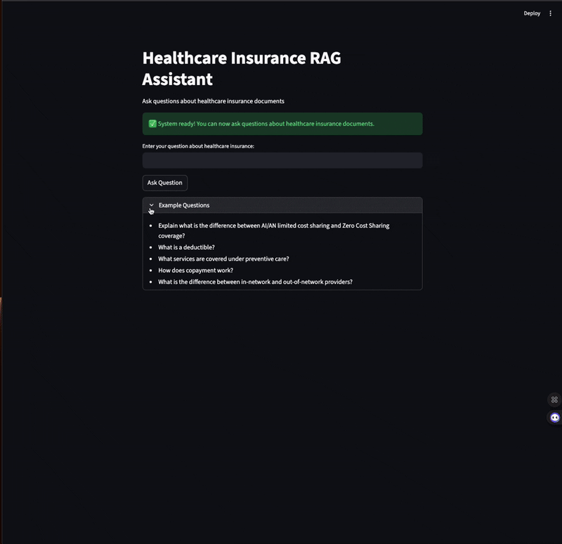

# 🏥 RAG-LLM Healthcare Insurance Assistant

## Description

An intelligent healthcare insurance document assistant powered by **Amazon Bedrock** and **Retrieval-Augmented Generation (RAG)**. This application allows you to upload complex healthcare insurance PDFs and get instant, accurate answers to your questions using state-of-the-art AI models.

**Transform your healthcare insurance documents into an interactive knowledge base!** 🚀
## Demo Videos

### 🔍 Data Query Interface


### 📚 Batch Processing Feature  

## ✨ Features

- **📄 Smart PDF Processing**: Upload healthcare insurance documents via intuitive Streamlit interface
- **🧠 AI-Powered Embeddings**: Generate high-quality embeddings using Amazon Titan Text Embeddings V2
- **💬 Intelligent Q&A**: Ask natural language questions and get contextual answers using Amazon Nova Lite
- **☁️ Cloud Storage**: Automatically store FAISS vector indexes in Amazon S3 for scalability
- **🔄 Cross-Region Support**: Leverage AWS cross-region inference for optimal performance
- **⚙️ Easy Configuration**: Simple environment variable setup
- **🎯 Healthcare Focused**: Optimized for insurance terminology, policies, and procedures

## 📋 Prerequisites

- **Python 3.8+**: Modern Python environment
- **AWS Account**: With access to Amazon Bedrock and S3
- **S3 Bucket**: For storing FAISS vector indexes
- **Model Access**: Enable Amazon Titan Text Embeddings V2 and Nova Lite in AWS Bedrock Console

### 🔑 Required AWS Services
- **Amazon Bedrock**: For AI model inference
- **Amazon S3**: For document and index storage
- **IAM Permissions**: For Bedrock and S3 access

## 🚀 Quick Start

### 1. Clone & Setup
```bash
git clone <repo-url>
cd RAG-LLM-Healthcare-Insurance

# Create virtual environment
python3 -m venv venv
source venv/bin/activate  # On Windows: venv\Scripts\activate

# Install dependencies
pip install -r Admin/requirements.txt
```

### 2. Configure AWS Credentials
Create a `.env` file in the project root:
```bash
AWS_ACCESS_KEY_ID=your_actual_access_key
AWS_SECRET_ACCESS_KEY=your_actual_secret_key
AWS_DEFAULT_REGION=us-east-2
BUCKET_NAME=your_s3_bucket_name
```

### 3. Enable AWS Bedrock Models
1. Go to **AWS Bedrock Console** → **Model Access**
2. Request access to:
   - `Amazon Titan Text Embeddings V2`
   - `Amazon Nova Lite`
3. Wait for approval (usually instant)

## 🎯 Usage

### Admin Interface - Document Processing
```bash
streamlit run Admin/admin.py --server.port 8501
```

**🌐 Open:** http://localhost:8501

**Features:**
- **📄 Single File Upload**: Upload individual PDF files for processing
- **📚 Bulk Processing**: Process all PDF files in `pdf-sources` folder automatically
- Automatic text extraction and chunking
- Generate embeddings using Titan V2
- Store vector indexes in S3 with unique naming
- Real-time progress tracking and detailed results

### User Interface - Interactive Q&A
```bash
streamlit run User/app.py --server.port 8502
```

**🌐 Open:** http://localhost:8502

**Features:**
- Ask natural language questions
- Get AI-powered answers from your documents
- Context-aware responses using Nova Lite
- Real-time document search

## 🧪 Testing Your Setup

### Complete Test Suite
Run all tests to verify your system is working correctly:
```bash
# Run all tests
./run_tests.sh
# or
python3 run_tests.py
```

### Individual Tests
Test specific components:
```bash
# AWS connectivity
python3 tests/test_s3_connection.py

# AI model access
python3 tests/test_bedrock_simple.py

# Complete system integration
python3 tests/test_complete_system.py
```

### Step-by-Step Testing
1. **Upload Documents**: Use sample PDFs in `pdf-sources/` folder
2. **Verify Processing**: Check for "Vector store created successfully" message  
3. **Test Queries**: Ask questions like:
   - "What is a deductible?"
   - "What services are covered under preventive care?"
   - "How does copayment work?"
4. **Check S3**: Verify vector store files uploaded to S3

### 📚 Bulk Processing Feature
Process all PDF files at once using the admin interface:

1. **Open Admin Interface**: http://localhost:8501
2. **Navigate to "Bulk Process All PDFs" tab**
3. **Review the list** of PDF files in `pdf-sources/` folder
4. **Click "Start Bulk Processing"** to process all files automatically
5. **Monitor progress** with real-time updates and progress bar
6. **Review results** with detailed processing statistics

**Alternative: Command Line Demo**
```bash
python3 demo_bulk_processing.py
```

## 📁 Project Structure

```
RAG-LLM-Healthcare-Insurance/
├── Admin/                   # 🏗️ Modular admin architecture
│   ├── admin.py              # 📄 Main admin interface entry point
│   ├── config.py             # ⚙️ Configuration and AWS client management
│   ├── s3_operations.py      # ☁️ Amazon S3 file operations
│   ├── pdf_processor.py      # 📚 PDF processing and vector stores
│   ├── bulk_processor.py     # 🔄 Bulk processing coordination
│   ├── ui_components.py      # 🎨 Streamlit UI components
│   ├── compatibility.py      # 🔗 Backward compatibility layer
│   ├── requirements.txt      # 📦 Python dependencies
│   ├── Dockerfile           # 🐳 Container configuration
│   └── README.md            # 📖 Architecture documentation
├── User/
│   └── app.py               # 💬 Question-answering interface
├── tests/                   # 🧪 Test suite
│   ├── test_s3_connection.py     # AWS S3 connectivity test
│   ├── test_bedrock_simple.py    # Bedrock model access test
│   ├── test_embedding_regions.py # Regional embedding test
│   ├── test_nova_converse.py     # Nova Lite conversation test
│   ├── test_boto3.py            # Boto3 configuration test
│   ├── test_admin_embedding.py  # Admin interface test
│   ├── test_user_interface.py   # User interface test
│   ├── test_bulk_processing.py  # Bulk PDF processing test
│   ├── test_complete_system.py  # End-to-end system test
│   └── README.md                # Test documentation
├── pdf-sources/             # 📚 Sample healthcare insurance PDFs
├── run_tests.py            # 🏃 Test runner script
├── run_tests.sh            # 🐚 Shell script for tests
├── demo_bulk_processing.py # 🔄 Bulk processing demo script
├── main.py                 # 🚀 Application entry point
├── .env                    # 🔐 Environment configuration
├── .gitignore             # 🚫 Git ignore rules
└── README.md              # 📖 This file
```

## 🔧 Technical Architecture

### 🏗️ Modular Design (v2.0)
The application follows a clean, modular architecture with separation of concerns:

- **Configuration Layer** (`config.py`): Centralized AWS client management
- **Storage Layer** (`s3_operations.py`): S3 file operations and duplicate checking
- **Processing Layer** (`pdf_processor.py`): PDF text extraction and vector creation
- **Orchestration Layer** (`bulk_processor.py`): Bulk processing coordination
- **Presentation Layer** (`ui_components.py`): Streamlit UI components
- **Compatibility Layer** (`compatibility.py`): Backward compatibility support

### AI Models Used
- **Amazon Titan Text Embeddings V2** (`amazon.titan-embed-text-v2:0`)
  - Generates 1024-dimensional embeddings
  - Optimized for document search and retrieval
  
- **Amazon Nova Lite** (`us.amazon.nova-lite-v1:0`)
  - Cross-region inference for optimal performance
  - Natural language generation for question answering

### Key Technologies
- **Streamlit**: Interactive web interfaces
- **LangChain**: Document processing and RAG pipeline
- **FAISS**: Vector similarity search
- **Amazon S3**: Cloud storage for indexes
- **Amazon Bedrock**: AI model inference
- **Modular Python Architecture**: Clean separation of concerns

## 🤝 Contributing

1. Fork the repository
2. Create a feature branch (`git checkout -b feature/amazing-feature`)
3. Commit your changes (`git commit -m 'Add amazing feature'`)
4. Push to the branch (`git push origin feature/amazing-feature`)
5. Open a Pull Request

## 📜 License

This project is licensed under the MIT License - see the LICENSE file for details.

## 🆘 Troubleshooting

### Common Issues

**❌ "AccessDeniedException" Error**
- Solution: Enable model access in AWS Bedrock Console
- Go to Bedrock → Model Access → Request access to Titan V2 and Nova Lite

**❌ "ValidationException" Error**  
- Solution: Check your AWS region configuration
- Ensure models are available in your selected region

**❌ "ConversationNotFound" Error**
- Solution: Restart Streamlit interfaces after boto3 updates
- Run: `pip install --upgrade boto3`

### Get Help
- Run the test suite: `./run_tests.sh` or `python3 run_tests.py`
- Check individual test outputs in the `tests/` directory
- Review AWS CloudWatch logs for detailed error messages
- Ensure your `.env` file has correct credentials

---

**Built with ❤️ for healthcare insurance professionals**
